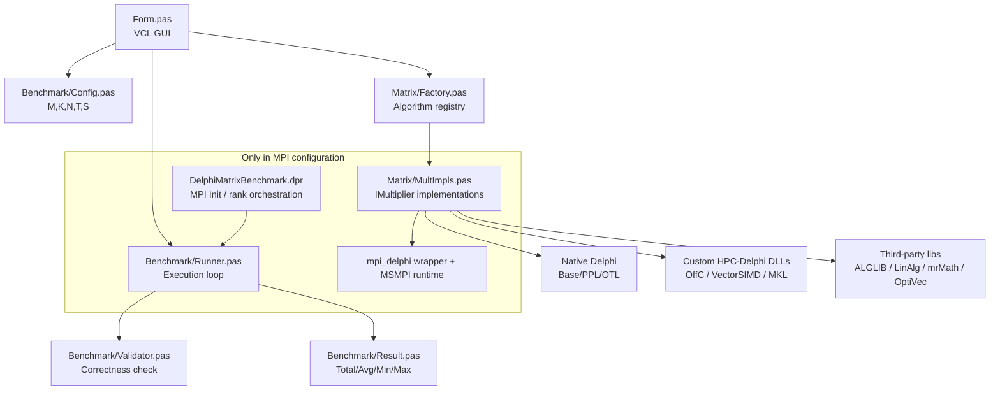

# DelphiMatrixBenchmark - HPC Matrix Multiplication Benchmark Client

[](https://www.microsoft.com/en-us/windows/windows-11)
[](https://www.embarcadero.com/products/delphi)
[](#build-configurations)

`DelphiMatrixBenchmark` is the desktop client application used in the **HPC-Delphi** research project to run, validate, and compare matrix multiplication implementations across multiple execution models:

- sequential baseline
- shared-memory parallelism (PPL, OTL, OpenMP)
- vectorized/SIMD kernels (Intel SIMD, AVX2)
- optimized linear algebra backends (ALGLIB, LinAlg/CBLAS, mrMath, MKL)
- distributed-memory MPI variants (MPI configuration)

The application provides a GUI to select algorithms, set benchmark parameters, execute repeated runs, and visualize results in both tabular and chart form.

---

## Features

- **Unified benchmark runner** for heterogeneous implementations under a common interface (`IMultiplier`).
- **Automatic result validation** against a deterministic reference computation before accepting timings.
- **Configurable workload**: matrix dimensions (`M`, `K`, `N`), worker threads (`T`), repetitions (`S`).
- **Comparative visualization** in VCL UI (`TStringGrid` + TeeChart bar plots).
- **Two build configurations** with explicit dependency boundaries:
  - `Release`: local/shared-memory algorithms
  - `MPI`: adds distributed algorithms and MPI runtime coordination

---

## Architecture Overview



---

## Repository Structure

```text
DelphiMatrixBenchmark/
│
├── Benchmark/
│   ├── Config.pas          # Benchmark input parameters
│   ├── Result.pas          # Benchmark output model
│   ├── Runner.pas          # Execution orchestration
│   └── Validator.pas       # Numerical correctness validation
│
├── Matrix/
│   ├── Factory.pas         # Name -> IMultiplier factory
│   ├── Multiplier.pas      # IMultiplier interface
│   ├── MultImpls.pas       # Concrete algorithm implementations
│   ├── Utils.pas           # Matrix helpers
│   ├── FastMath.pas        # Auxiliary/experimental units
│   ├── DelphiStrassen.pas  # Auxiliary/experimental units
│   └── LUImpls.pas         # Auxiliary/experimental units
│
├── Form.pas / Form.dfm     # GUI and interaction logic
├── DelphiMatrixBenchmark.dpr
├── DelphiMatrixBenchmark.dproj
├── CITATION.cff
├── LICENSE
└── README.md
```

---

## Requirements & Development Environment

The project is developed and validated in the following environment:

- **Operating System**: Windows 11 (64-bit)
- **IDE**: RAD Studio / Delphi 12.1 or newer
- **Target platform**: `Win64`
- **MPI runtime (MPI config only)**: Microsoft MPI (MSMPI)

> 32-bit builds are not recommended for large matrix workloads due to memory limitations.

---

## Dependencies

This project combines **HPC-Delphi custom libraries** and **third-party libraries/toolkits**.

## 1) HPC-Delphi custom dependencies (GitHub organization)

These repositories are part of the same research ecosystem and are required by this client:

- [`offc_delphi`](https://github.com/HPC-Delphi/offc_delphi)  
  C/OpenMP/AVX2 kernels exposed to Delphi via `OffC.pas`.

- [`vector_simd_delphi`](https://github.com/HPC-Delphi/vector_simd_delphi)  
  SIMD helper wrapper used by Intel SIMD paths.

- [`mkl_delphi`](https://github.com/HPC-Delphi/mkl_delphi)  
  Delphi interface for Intel MKL-backed operations.

- [`mpi_delphi`](https://github.com/HPC-Delphi/mpi_delphi) *(MPI configuration only)*  
  Delphi bindings for MPI primitives used by distributed algorithms.

### Expected custom DLLs

- `offc_delphi.dll`
- `vector_simd_delphi.dll`
- `mkl_delphi.dll`
- `mpi_delphi.dll` *(MPI configuration only)*

## 2) Third-party libraries referenced by the project

From `DelphiMatrixBenchmark.dproj` and source units:

- **ALGLIB (Delphi wrapper)** (`xalglib`)
- **LinAlg / CBLAS wrapper** (`LinAlg.cblas_dgemm`)
- **mrMath** (`FMAMatrixMult*` routines)
- **OptiVec for Delphi** (`vecLib`, `VDstd`, `VDmath`)
- **FastMath** (Delphi math utilities)
- **OmniThreadLibrary** (`OTLParallel`)
- **TeeChart VCL** (GUI chart rendering)
- **JEDI VCL (JVCL)** (project-level UI dependency noted in paper project docs)

## 3) External runtimes / toolchains

- **Intel oneAPI Base Toolkit** (for MKL workflows and OpenMP runtime support)
- **Microsoft MPI (MSMPI)** runtime + SDK *(for MPI configuration)*

---

## Dependency setup in RAD Studio

Open the project in RAD Studio and configure:

`Project -> Options -> Building -> Delphi Compiler -> Search path`

### Base search paths (used by Release and inherited by MPI)

```text
C:\Users\user\Software\DelphiHPC\libraries\third_party\linalg\Delphi12-Win64
C:\Users\user\Software\DelphiHPC\libraries\third_party\mrMath
C:\Users\user\Software\DelphiHPC\libraries\third_party\OptiVec_for_Delphi\win64\Lib8
C:\Users\user\Software\DelphiHPC\libraries\third_party\alglib-delphi\wrapper
C:\Users\user\Software\DelphiHPC\libraries\third_party\FastMath\FastMath
C:\Users\user\Software\DelphiHPC\libraries\custom\offc_delphi\interface
C:\Users\user\Software\DelphiHPC\libraries\custom\vector_simd_delphi\interface
C:\Users\user\Software\DelphiHPC\libraries\custom\mkl_delphi\interface
C:\Program Files (x86)\Steema Software\Steema TeeChart Standard VCL FMX 2026.46\Delphi29\Delphi29.win64\Lib
```

### Additional search path for MPI configuration

```text
C:\Users\user\Software\DelphiHPC\libraries\custom\mpi_delphi\interface
```

---

## Build configurations

The project defines two primary Win64 configurations:

### `Release`

- Compiler define: `RELEASE`
- Includes local/shared-memory algorithms:
  - Base, OffC-Base
  - PPL, OTL, OffC-OMP
  - IntelSIMD / OffC-AVX2 / PPL+IntelSIMD / OffC-OMP+AVX2
  - ALGLIB, LINALG, mrmath, OffC-MKL

### `MPI`

- Compiler define: `MPI`
- Inherits all base dependencies and adds MPI interfaces.
- Adds distributed variants:
  - `MPI+Base`
  - `MPI+PPL+IntelSIMD`
  - `MPI+OffC-OMP+AVX2`
  - `MPI+OffC-MKL`
- Runtime behavior changes (`DelphiMatrixBenchmark.dpr`):
  - rank 0 hosts GUI and orchestrates runs
  - worker ranks wait for algorithm broadcasts and execute compute kernels

---

## DLL deployment (critical)

For reproducible execution, copy required DLLs into the output folder of the selected configuration:

- `Win64\Release\`
- `Win64\MPI\`

At minimum:

- `offc_delphi.dll`
- `vector_simd_delphi.dll`
- `mkl_delphi.dll`
- `alglib405_64hpc.dll`
- `mpi_delphi.dll` *(MPI only)*

> In this project, `alglib405_64hpc.dll` is expected to be physically present in the output directory (not only in global `PATH`).

---

## RAD Studio build guide (step-by-step)

### A) Build `Release`

1. Open `DelphiMatrixBenchmark.dproj` in RAD Studio.
2. Set **Target Platform** to `Win64`.
3. Select **Build Configuration** = `Release`.
4. Verify search paths listed above (base set).
5. Build the custom dependency DLLs (`offc_delphi`, `vector_simd_delphi`, `mkl_delphi`) and copy DLLs to `Win64\Release\`.
6. Ensure `alglib405_64hpc.dll` is also copied to `Win64\Release\`.
7. Build project: **Project -> Build DelphiMatrixBenchmark**.

### B) Build `MPI`

1. Select **Build Configuration** = `MPI`.
2. Confirm `mpi_delphi\interface` is present in search path.
3. Ensure MSMPI runtime is installed.
4. Copy all required DLLs to `Win64\MPI\`, including `mpi_delphi.dll`.
5. Build project.

### C) Run `MPI` executable

Run using `mpiexec` (example with 4 ranks):

```bat
mpiexec -n 4 Win64\MPI\DelphiMatrixBenchmark.exe
```

---

## Building `mkl_delphi` (if needed)

If you need to rebuild `mkl_delphi` using Intel oneAPI + MS Build Tools:

```bat
:: 1) Point Intel script to VS Build Tools
set "VS2022INSTALLDIR=C:\Program Files (x86)\Microsoft Visual Studio\18\BuildTools"

:: 2) Load oneAPI environment
call "C:\Program Files (x86)\Intel\oneAPI\setvars.bat"

:: 3) Build mkl_delphi
cd C:\Users\user\Software\DelphiHPC\libraries\custom\mkl_delphi
nmake
```

Optional OpenMP runtime path (environment-dependent):

```text
C:\Program Files (x86)\Intel\oneAPI\compiler\2026.0\lib
```

---

## Running benchmarks

1. Launch the executable (`Release` or `MPI` build output).
2. Configure benchmark parameters:
   - `M`, `K`, `N` (matrix dimensions)
   - `T` (thread count for relevant algorithms)
   - `S` (number of repetitions)
3. Select one or more algorithm implementations.
4. Execute benchmark.
5. Review:
   - tabular metrics: `Total`, `Avg`, `Min`, `Max`
   - comparative bar chart

The runner validates numerical correctness before accepting timing results.

---

## Notes and known constraints

- MPI implementations assume `M` is divisible by process count in current scatter/gather strategy.
- This repository includes auxiliary units (e.g., `LUImpls.pas`) not wired into the default algorithm list shown by the GUI factory.
- Prefer `Win64` only for realistic HPC-size matrices.

---

## Academic citation

If you use this software in your research, please cite it using the metadata provided in `CITATION.cff`.

---

## License

This project is licensed under the MIT License. See `LICENSE` for details.
