# DelphiMatrixBenchmark - HPC Matrix Multiplication Benchmark Client

[](https://www.microsoft.com/en-us/windows/windows-11)
[](https://www.embarcadero.com/products/delphi)

`DelphiMatrixBenchmark` is the desktop client application used in the **HPC-Delphi** research project to run, validate, and compare matrix multiplication implementations across multiple execution models:

- sequential baseline
- shared-memory parallelism (PPL, OTL, OpenMP)
- vectorized/SIMD kernels (VectorSIMD, AVX2)
- optimized linear algebra backends (ALGLIB, LinAlg/CBLAS, mrMath, MKL)
- distributed-memory MPI variants (MPI configuration)

The application provides a GUI to select algorithms, set benchmark parameters, execute repeated runs, and visualize results in both tabular and chart form.

---

## Features

- **Unified benchmark runner** for heterogeneous implementations under a common interface (`IMultiplier`).
- **Automatic result validation** against a deterministic reference computation before accepting timings.
- **Configurable workload**: matrix dimensions (`M`, `K`, `N`), worker threads (`T`), repetitions (`S`).
- **Comparative visualization** in VCL UI (`TStringGrid` + TeeChart bar plots).
- **Two build configurations** with explicit dependency boundaries:
  - `Release`: local/shared-memory algorithms
  - `MPI`: adds distributed algorithms and MPI runtime coordination

---

## Architecture Overview

```mermaid
flowchart TD
    subgraph MPI_Mode[Only in MPI configuration]
      MPIINIT[DelphiMatrixBenchmark.dpr<br/>MPI_Init · rank split]
    end

    MPIINIT -->|rank 0| UI
    MPIINIT -->|worker ranks| IMPL

    UI[Form.pas<br/>VCL GUI] --> CFG[Benchmark/Config.pas<br/>M,K,N,T,S]
    UI --> FAC[Matrix/Factory.pas<br/>Algorithm registry]
    UI --> RUN[Benchmark/Runner.pas<br/>Execution loop]

    FAC --> IMPL[Matrix/MultImpls.pas<br/>IMultiplier implementations]
    RUN --> IMPL
    RUN --> VAL[Benchmark/Validator.pas<br/>Correctness check]
    RUN --> RES[Benchmark/Result.pas<br/>Total/Avg/Min/Max]

    IMPL --> CORE1[Native Delphi<br/>Base / PPL / OTL / ASM]
    IMPL --> CORE2[HPC-Delphi DLLs<br/>OffC / VectorSIMD / MKL]
    IMPL --> CORE3[Third-party libs<br/>ALGLIB / LinAlg / mrMath / OptiVec]

    RUN --> MPILIB[mpi_delphi + MSMPI<br/>&#40;MPI config only&#41;]
    IMPL --> MPILIB
```



---

## Repository Structure

```text
DelphiMatrixBenchmark/
│
├── Benchmark/
│   ├── Config.pas          # Benchmark input parameters
│   ├── Result.pas          # Benchmark output model
│   ├── Runner.pas          # Execution orchestration
│   └── Validator.pas       # Numerical correctness validation
│
├── Matrix/
│   ├── Factory.pas         # Name -> IMultiplier factory
│   ├── Multiplier.pas      # IMultiplier interface
│   ├── MultImpls.pas       # Concrete algorithm implementations
│   └── Utils.pas           # Matrix helpers
│
├── Form.pas / Form.dfm     # GUI and interaction logic
├── DelphiMatrixBenchmark.dpr
├── DelphiMatrixBenchmark.dproj
├── CITATION.cff
├── LICENSE
└── README.md
```

---

## Requirements & Development Environment

The project is developed and validated in the following environment:

- **Operating System**: Windows 11 (64-bit)
- **IDE**: RAD Studio / Delphi 12.1
- **Target platform**: `Win64`
- **MPI runtime (MPI config only)**: Microsoft MPI (MSMPI)

---

## Dependencies

This project uses two explicit dependency profiles (`Release` and `MPI`).
The key idea is:
- `Release` includes local/shared-memory algorithms and their extra third-party libraries.
- `MPI` includes distributed algorithms and MPI stack, without requiring Release-only third-party libraries.

### 1) Dependency matrix (by type and configuration)

| Type | Component | Release | MPI | Why |
|---|---|:---:|:---:|---|
| Toolkit | RAD Studio / Delphi 12.1 (Win64) | ✅ | ✅ | Build system / IDE |
| Library (HPC-Delphi) | `offc_delphi` | ✅ | ✅ | Core + MPI hybrid (`MPI+OffC-OMP+AVX2`) |
| Library (HPC-Delphi) | `vector_simd_delphi` | ✅ | ✅ | Core + MPI hybrid (`MPI+PPL+VectorSIMD`) |
| Library (HPC-Delphi) | `mkl_delphi` | ✅ | ✅ | Core + MPI hybrid (`MPI+OffC-MKL`) |
| Library (HPC-Delphi) | `mpi_delphi` | ❌ | ✅ | Delphi bindings for MPI primitives |
| Library (third-party) | ALGLIB | ✅ | ❌ | Release-only implementations |
| Library (third-party) | Winsoft Linear Algebra (LinAlg) | ✅ | ❌ | Release-only implementations |
| Library (third-party) | mrMath / FastMath units | ✅ | ❌ | Release-only implementations |
| Library (third-party) | OptiVec | ✅ | ❌ | Release-only implementations |
| Library (third-party) | OmniThreadLibrary (OTL) | ✅ | ❌ | Release-only implementations |
| Library (UI) | TeeChart VCL | ✅ | ✅ | Result visualization |
| Toolkit | Intel oneAPI Base Toolkit | ✅ | ✅ | MKL/OpenMP environment |
| Runtime | MSMPI Runtime | ❌ | ✅ | Required to execute MPI binaries |

### 2) Dependency catalog

#### HPC-Delphi libraries
- [`offc_delphi`](https://github.com/HPC-Delphi/offc_delphi)
- [`vector_simd_delphi`](https://github.com/HPC-Delphi/vector_simd_delphi)
- [`mkl_delphi`](https://github.com/HPC-Delphi/mkl_delphi)
- [`mpi_delphi`](https://github.com/HPC-Delphi/mpi_delphi) *(MPI only)*

#### Third-party libraries
- [ALGLIB](https://www.alglib.net/)
- [Winsoft Linear Algebra](https://winsoft.sk/linalg.htm)
- [mrMath](https://github.com/mikerabat/mrmath)
- [OptiVec](https://www.optivec.com/)
- [FastMath](https://github.com/neslib/FastMath)
- [OmniThreadLibrary](http://www.omnithreadlibrary.com/)
- [Steema TeeChart VCL](https://steema.com/product/vcl)

#### Toolkits / SDKs
- RAD Studio / Delphi 12.1 (Win64)
- Intel oneAPI Base Toolkit
- Microsoft MPI SDK *(MPI only)*

#### Runtimes
- Microsoft MPI Runtime *(MPI only)*

## Dependency setup in RAD Studio

Configure search paths in:
`Project -> Options -> Building -> Delphi Compiler -> Search path`

### Common paths (Release + MPI)

```text
path\to\offc_delphi\interface
path\to\vector_simd_delphi\interface
path\to\mkl_delphi\interface
```

### Release-only paths

```text
path\to\alglib-delphi\wrapper
path\to\linalg\Delphi12-Win64
path\to\mrMath
path\to\OptiVec_for_Delphi\win64\Lib8
path\to\FastMath\FastMath
```

### MPI-only path

```text
path\to\mpi_delphi\interface
```

Note: these profiles are intentionally separated so MPI builds do not require Release-only third-party libraries.

---

## Build configurations

The project defines two Win64 configurations with exclusive algorithm sets.

### `Release`
- Compiler define: `RELEASE`
- Available implementations:
  - `Base`, `OffC-Base`
  - `PPL`, `OTL`, `OffC-OMP`
  - `VectorSIMD`, `OffC-AVX2`, `ASM`
  - `PPL+VectorSIMD`, `OffC-OMP+AVX2`
  - `ALGLIB`, `LINALG`, `mrmath`, `OffC-MKL`
- Requires Release-only third-party dependencies listed above.

### `MPI`
- Compiler define: `MPI`
- Available implementations:
  - `MPI+Base`
  - `MPI+PPL+VectorSIMD`
  - `MPI+OffC-OMP+AVX2`
  - `MPI+OffC-MKL`
- Requires common dependencies listed above and `mpi_delphi` + MSMPI.
- Runtime behavior (`DelphiMatrixBenchmark.dpr`):
  - rank 0 hosts GUI and orchestrates runs
  - worker ranks execute broadcasted MPI algorithms

---

## DLL deployment

To run the executable successfully, all required DLLs must be discoverable by Windows.
Choose one of the following methods:

### Method A: Add DLL directories to system PATH (*Recommended for Development*)

During active development, this avoids copying DLLs after every rebuild.

Add these directories to your Windows `Path` environment variable:

- `path\to\offc_delphi\build`
- `path\to\vector_simd_delphi\build`
- `path\to\mkl_delphi\build`
- `path\to\alglib-delphi\wrapper` *(Release only)*
- `path\to\mpi_delphi\build` *(MPI only)*

### Method B: Copy DLLs into the executable folder (*Recommended for Distribution*)

Copy required DLLs into the selected build output directory:

- `Win64\Release\`
- `Win64\MPI\`

At minimum:

- `offc_delphi.dll`
- `vector_simd_delphi.dll`
- `mkl_delphi.dll`
- `alglib405_64hpc.dll` *(Release only)*
- `mpi_delphi.dll` *(MPI only)*
- MSMPI runtime available in system `PATH` (e.g., `msmpi.dll`) *(MPI only)*

---

## RAD Studio build guide (step-by-step)

### A) Build `Release`

1. Open `DelphiMatrixBenchmark.dproj` in RAD Studio.
2. Set **Target Platform** to `Win64`.
3. Select **Build Configuration** = `Release`.
4. Verify common + `Release`-only search paths listed above.
5. Ensure required runtime DLLs are discoverable using one of these options:
   - add their directories to system `Path` (development), or
   - copy them into `Win64\Release\` (distribution).
6. Confirm at least: `offc_delphi.dll`, `vector_simd_delphi.dll`, `mkl_delphi.dll`, `alglib405_64hpc.dll`.
7. Build project: **Project -> Build DelphiMatrixBenchmark**.

### B) Build `MPI`

1. Select **Build Configuration** = `MPI`.
2. Confirm `mpi_delphi\interface` is present in search path.
3. Ensure MSMPI runtime is installed.
4. Ensure required DLLs are discoverable using one of these options:
   - add their directories to system `Path` (including MSMPI runtime), or
   - copy all required DLLs to `Win64\MPI\`.
5. Confirm at least:
   - `mpi_delphi.dll`
   - MSMPI runtime available in `PATH` (e.g., `msmpi.dll`)
   - `offc_delphi.dll` for `MPI+OffC-OMP+AVX2`
   - `vector_simd_delphi.dll` for `MPI+PPL+VectorSIMD`
   - `mkl_delphi.dll` for `MPI+OffC-MKL`
6. Build project.

### C) Run `MPI` executable

Run using `mpiexec` (example with 4 ranks):

```bat
mpiexec -n 4 Win64\MPI\DelphiMatrixBenchmark.exe
```

---

## Running benchmarks

1. Launch the executable (`Release` or `MPI` build output).
2. Configure benchmark parameters:
   - `M`, `K`, `N` (matrix dimensions)
   - `T` (thread count for relevant algorithms)
   - `S` (number of repetitions)
3. Select one or more algorithm implementations.
4. Execute benchmark.
5. Review:
   - tabular metrics: `Total`, `Avg`, `Min`, `Max`
   - comparative bar chart

The runner validates numerical correctness before accepting timing results.

---

## Known Constraints

### Dependency availability and licensing

Some third-party dependencies used in this project may not be permanently available to all users:

- some were used under **trial/evaluation licenses** for the paper,
- some are **open source**,
- some are **free-to-use** but not open source.

Because of this, certain compute/linear-algebra implementations may be unavailable in other environments.

### Building without unavailable third-party compute libraries

If one or more compute/linear-algebra dependencies are missing, the project can still be compiled by disabling those implementations.

#### 1) Remove algorithm entries from the registry

Edit `Matrix/Factory.pas`:

- remove the corresponding name(s) from `TFactory.GetAvailable`
- remove the corresponding `else if Name = '...' then Result := ...` branch(es) from `TFactory.CreateByName`

#### 2) Remove/comment the corresponding implementations

Edit `Matrix/MultImpls.pas`:

- remove unavailable unit(s) from the `uses` clause
- remove or comment class declarations and implementations tied to those unit(s)

**Dependency -> code mapping**

- **ALGLIB**
  - Unit: `XALGLIB`
  - Class: `TALGLIB`
  - Factory name: `'ALGLIB'`

- **Winsoft Linear Algebra**
  - Unit: `LinAlg`
  - Class: `TLinearAlgebra`
  - Factory name: `'LINALG'`

- **OptiVec**
  - Units: `vecLib`, `VDstd`, `VDmath`
  - Class: `TOptiVecVectorLib`
  - Factory name: `'OptiVec-VectorLib'`

- **mrMath / FastMath-dependent paths**
  - Units: `FMAMatrixMultOperationsx64`, `FMAMatrixMultTransposedOperationsx64`
  - Classes: `Tmrmath`, `TASM`
  - Factory names: `'mrmath'`, `'ASM'`

- **OmniThreadLibrary (OTL)**
  - Unit: `OTLParallel`
  - Class: `TOTL`
  - Factory name: `'OTL'`

---

## Academic citation

If you use this software in your research, please cite it using the metadata provided in `CITATION.cff`.

---

## License

This project is licensed under the MIT License. See `LICENSE` for details.
